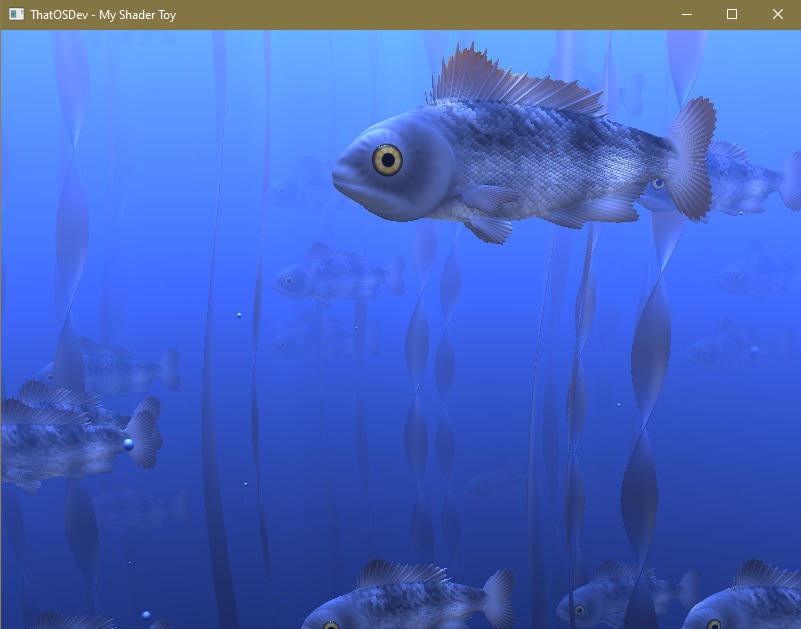

# MyShaderToy
This is my C version of a GLSL Shader Toy  
  
ShaderToy website  
https://www.shadertoy.com/  
  
WARNING : Can be Graphic Card intensive. USE AT YOUR OWN RISK !  
   
YOUTUBE VIDEO DEMONSTRATION  
https://www.youtube.com/watch?v=ftoLXl91O1E  
   
The GLAD 2 and GLFW3 3.3.8 are both included. Run the bat file if on windows to compile.  
  
**NOTES**  
* Tested to work only on Windows.  
* Using GCC as the compiler.  
* Not all features from the shadertoy website are added. Up to you to add them if you wish.  
  
  
HITTING THE R KEY RELOADS THE TEXT FILE  
HITTING THE ESCAPE (ESC) KEY CLOSES THE PROGRAM  
  
  
  